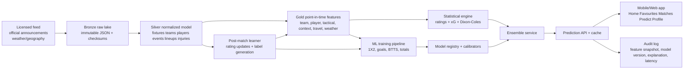
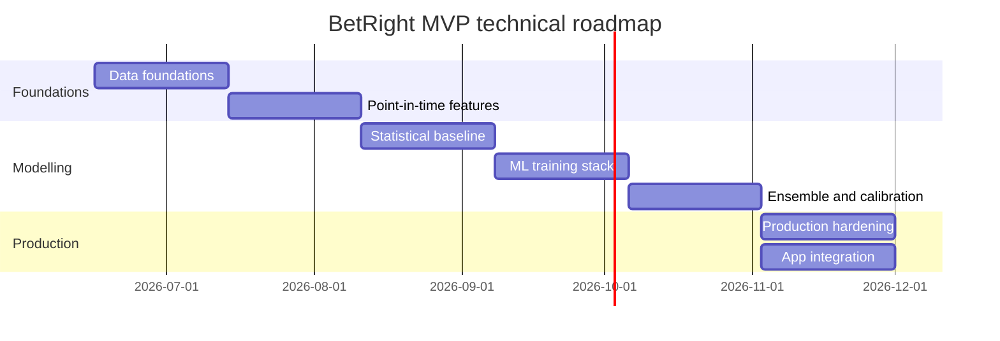

# BetRight End-to-End Prediction and ML System

## Executive summary

BetRight should be implemented as a **point-in-time, auditable, hybrid forecasting system** rather than as a single-model predictor. The strongest production design is a layered stack: licensed or official match-data ingestion; immutable raw storage; normalized football entities; a point-in-time feature store; an in-house expected-goals engine; a Poisson/Dixon-Coles scoreline layer; tabular ML models for result and market probabilities; a calibrated ensemble; and a post-match learning loop that updates ratings, logs error, and retrains on schedule. That approach directly operationalises the product direction already laid out in your existing BetRight predictor PRD, which calls for hybrid modelling, self-learning, player availability, psychology/context, calibration, confidence scoring, auditability, and explainable outputs. It also fits the app architecture you already defined, where Match Detail needs overview, stats, form, H2H, lineups, players, markets and news, and where Profile must house responsible-use and region-aware controls. fileciteturn0file0 fileciteturn0file1

For production, **open football data is good for prototyping but not sufficient as the sole live backbone**. StatsBomb’s open repository is valuable because it exposes competitions, matches, events, lineups and selected 360 data in JSON form, making it strong for prototyping, replay and research. But an operational app that wants broader fixture coverage, lower-latency live refreshes, richer lineup/availability context, and clearer rights needs a licensed primary feed. Reuters’ report on FIFA’s 2026 data agreement is a useful illustration of the rights model in this market: RunningBall supplies official betting data while Opta supplies player statistics, match insights, scores and trackers to licensed sportsbooks. citeturn6view2turn7view0turn27news0

The core modelling recommendation is to **keep three engines in production at all times**. First, a statistical baseline built around team ratings and a Dixon-Coles-corrected score matrix. Second, in-house shot-level xG and team-level pre-match xG models. Third, gradient-boosted tabular ML models for 1X2, goals, BTTS and totals. That hybrid strategy is consistent with the literature: Dixon-Coles remains a reference point for football forecasting, low-score dependence matters in football, and modern xG work shows that shot-context, player effects, and subgroup calibration all materially affect probability quality. Ensemble-based football prediction studies also continue to find strong performance from explainable tabular ML approaches rather than from opaque deep models in typical tabular match datasets. citeturn1academia0turn17academia2turn36academia3turn36academia2turn44academia0turn42academia2

The practical build order should be: **data contracts and schema first; point-in-time feature generation second; statistical baseline third; ML training and calibration fourth; production APIs, audit logs and monitoring fifth; lineup-refresh and scenario simulation sixth**. Do not let the mobile app get ahead of the data and audit stack. If the model cannot answer “what data did we know at prediction time, which model version scored this match, and why did the probability move?”, then it is not production-ready for BetRight’s stated positioning as an “AI sports prediction intelligence” product. fileciteturn0file0 fileciteturn0file1

## Assumptions and source strategy

The assumptions below are open-ended defaults for planning, not hard constraints.

| Planning item | Working default |
|---|---|
| Sport scope | Football first, schema designed to support more sports later |
| Competition scope | Top domestic leagues, major continental tournaments, and South African-relevant football where licensed |
| Prediction scope | Pre-match in MVP, lineup refresh near kickoff, in-play later |
| Data access | One licensed match/event feed plus open research data for prototyping and backfill |
| Compute budget | CPU-first tabular ML, no GPU dependency in MVP |
| Deployment targets | Batch overnight + pre-match refreshes + on-demand API |

The recommended **source hierarchy** is: a licensed primary football feed for fixtures, results, live incidents, official lineups and competition metadata; official club or competition announcements as provenance-logged verification sources for player availability changes; a separate weather feed for forecast and historical weather; venue and geography data for travel features; and open research data for prototyping, regression tests and reproducible experiments. StatsBomb Open Data is ideal for early R&D because it already exposes events, lineups and selected 360 frames, while the Reuters-reported FIFA/Stats Perform agreement shows why production football operators typically rely on licensed rights-bearing feeds for live official data. citeturn6view2turn7view0turn27news0

The most important data-source principle is **provenance**. Every imported record should carry `source_name`, `source_record_id`, `ingest_ts`, `effective_ts`, `entitlement_class`, and `source_confidence`. Injuries and probable lineups are especially sensitive: they must be stored with probability and provenance, not as flat truth values. BetRight’s own PRD already requires data quality scoring and confidence logic; this design extends that by making source provenance a first-class feature and an audit artifact. fileciteturn0file0

For xG specifically, BetRight should **ingest vendor xG if available but still maintain an internal shot model**. That avoids vendor lock-in, gives you consistency across competitions and seasons, and lets you calibrate for player and subgroup effects. Recent work on xG shows three highly relevant things for BetRight: gradient boosting and logistic methods work well on shot probability estimation; player effects can persist even after richer contextual predictors are included; and standard xG models can be biased in ways that confound finishing evaluation unless subgroup-aware calibration is applied. citeturn36academia3turn36academia2turn44academia0

A practical source matrix for MVP is below.

| Data domain | Primary recommendation | Secondary / fallback | Key implementation note |
|---|---|---|---|
| Fixtures, results, live incidents | Licensed official feed | Public fixture feeds for non-production prototyping | Must include stable fixture IDs and kickoff timestamps |
| Event-level actions and shots | Licensed event feed or StatsBomb-style event feed | StatsBomb Open Data for prototype/backtest | Needed for in-house xG, tactical proxies and post-match updates |
| Lineups | Official lineups feed from primary vendor | Competition/team sheet ingestion | Must be time-stamped as probable vs confirmed |
| Injuries / suspensions | Structured availability feed where licensed | Official club/competition announcements | Store probability, confidence and reason |
| Weather | Forecast API + historical meteorological archive | National weather service archive near venue | Join by nearest station and kickoff time |
| Travel | Venue geocodes + previous fixture coordinates | Static home-base coordinates | Use both straight-line km and timezone shift |

## Technical design

BetRight’s architecture should follow a **Bronze → Silver → Gold → Serving** pattern. Bronze stores immutable raw payloads. Silver normalizes competitions, teams, players, venues, fixtures, events, lineups, injuries, weather and travel entities. Gold produces point-in-time feature snapshots and label sets. Serving hosts calibrated models, explanation artifacts, and prediction APIs. This matches the product need for auditable storage and replayable prediction history that your PRD already defines. fileciteturn0file0



The **non-negotiable implementation rule** is that all features must be built with **as-of joins**, never with mutable “latest state” joins. That means lineups, injuries, weather forecasts, rating tables and even team mappings are joined using the timestamp that was actually known when the prediction was issued. This is what makes offline evaluation fair and what makes prediction replay possible. It is also the right way to satisfy the PRD requirement that each prediction be stored with timestamp, model version and input snapshot. fileciteturn0file0

A compact normalized schema for the core production tables is below.

| Layer | Key tables |
|---|---|
| Bronze | `raw_payload`, `raw_file_manifest`, `raw_source_error` |
| Silver | `competition`, `season`, `team`, `player`, `venue`, `fixture`, `match_result`, `event`, `shot_event`, `lineup`, `player_availability`, `weather_snapshot`, `travel_snapshot` |
| Gold | `team_match_rollup`, `player_match_rollup`, `feature_snapshot`, `training_row_1x2`, `training_row_goals`, `training_row_markets` |
| Serving | `model_registry`, `calibrator_registry`, `prediction`, `prediction_explanation`, `evaluation_result`, `alert_event`, `audit_log` |

A minimal DDL pattern for the two most important serving artifacts is:

```sql
create table feature_snapshot (
    snapshot_id uuid primary key,
    fixture_id bigint not null,
    as_of_ts timestamptz not null,
    feature_version text not null,
    features jsonb not null,
    data_quality_score numeric(5,2) not null,
    dq_flags jsonb not null,
    source_manifest jsonb not null,
    feature_hash text not null,
    unique (fixture_id, as_of_ts, feature_version)
);

create table prediction (
    prediction_id uuid primary key,
    fixture_id bigint not null,
    snapshot_id uuid not null references feature_snapshot(snapshot_id),
    model_version text not null,
    calibrator_version text,
    predicted_at timestamptz not null,
    market_probs jsonb not null,
    expected_goals jsonb not null,
    score_matrix_ref text not null,
    confidence_score numeric(5,2) not null,
    explanation_ref text not null,
    latency_ms integer not null,
    status text not null
);
```

The **prediction service** should generate a snapshot first, score the statistical and ML models second, calibrate and ensemble third, then persist the full audit record before returning the prediction. That is the safest sequence for reproducibility.

```python
def predict_fixture(fixture_id, as_of_ts):
    snap = build_feature_snapshot(fixture_id, as_of_ts)
    dq = score_data_quality(snap)

    # statistical layer
    lambda_home, lambda_away = expected_goals_engine(snap)
    poisson_dc = dixon_coles_matrix(lambda_home, lambda_away, rho=snap["dc_rho"])

    # ML layer
    p_1x2_ml = model_1x2.predict_proba(snap)
    goals_ml = {
        "home": model_home_goals.predict(snap),
        "away": model_away_goals.predict(snap),
        "btts": model_btts.predict_proba(snap),
        "over25": model_over25.predict_proba(snap),
    }

    # ensemble + calibration
    ensemble_probs = ensemble(poisson_dc, p_1x2_ml, goals_ml, snap, dq)
    calibrated_probs = calibrate(ensemble_probs, scenario_key=snap["cluster_key"])

    confidence = confidence_engine(calibrated_probs, snap, dq)
    explanation = build_explanation(snap, calibrated_probs, poisson_dc, goals_ml)

    persist_prediction(fixture_id, snap, calibrated_probs, lambda_home, lambda_away,
                       confidence, explanation, dq)
    return response_object(...)
```

The **expected-goals engine** should be implemented in log-space for stability, even if product language describes it multiplicatively. A strong pre-match formulation is:

\[
\log \lambda_{home} =
\beta_0
+ \beta_1 \log Attack_{home}
+ \beta_2 \log DefenceWeakness_{away}
+ \beta_3 HomeAdvantage
+ \beta_4 Form_{home}
+ \beta_5 LineupImpact_{home}
+ \beta_6 OppAdj_{home}
+ \beta_7 Tactics_{home\rightarrow away}
+ \beta_8 Psychology_{home}
+ \beta_9 FatigueTravel_{away}
+ \beta_{10} Weather
\]

\[
\log \lambda_{away} =
\beta_0
+ \beta_1 \log Attack_{away}
+ \beta_2 \log DefenceWeakness_{home}
+ \beta_3 AwayContext
+ \beta_4 Form_{away}
+ \beta_5 LineupImpact_{away}
+ \beta_6 OppAdj_{away}
+ \beta_7 Tactics_{away\rightarrow home}
+ \beta_8 Psychology_{away}
+ \beta_9 FatigueTravel_{away}
+ \beta_{10} Weather
\]

Clamp the final `λ` values to the same safety range already anticipated by your PRD, namely roughly **0.15 to 5.50**, and log every clamp event for model-quality review. That clamp is sensible for product stability, but if clamp rates rise materially, the upstream ratings are drifting. In parallel, the internal shot model should estimate shot-level xG as \(p(goal \mid shot)=\sigma(f(x))\), with logistic or gradient-boosted classifiers over shot context, which is consistent with recent football xG work. fileciteturn0file0 citeturn36academia3turn36academia2

For exact scorelines and derivative markets, use a **Dixon-Coles corrected score matrix** rather than a pure independent Poisson matrix. The practical reason is simple: low scores such as 0-0, 1-0, 0-1 and 1-1 are correlated in real football in ways that independent Poisson misses. Recent literature summarizing and extending Dixon-Coles is clear that the model specifically reweights those low-score cells and remains a standard reference in football modelling. citeturn17academia2turn1academia0

Use the standard low-score correction:

\[
P(X=x,Y=y)=\tau(x,y;\lambda,\mu,\rho)\cdot Pois(x;\lambda)\cdot Pois(y;\mu)
\]

with

\[
\tau=
\begin{cases}
1-\lambda\mu\rho & x=0,y=0 \\
1+\lambda\rho & x=0,y=1 \\
1+\mu\rho & x=1,y=0 \\
1-\rho & x=1,y=1 \\
1 & \text{otherwise}
\end{cases}
\]

Estimate \(\rho\) by league cluster or competition family. Do not hard-code one global value forever.

Finally, the **post-match learning loop** should update both ratings and training data, but the update should be based on more than the final score.

```python
def post_match_update(match_id):
    actual = ingest_official_result(match_id)
    pred = latest_pre_kick_prediction(match_id)
    snap = fetch_snapshot(pred.snapshot_id)

    metrics = evaluate_prediction(pred, actual)
    log_errors(match_id, pred, actual, metrics)

    update_elo(
        home_team=actual.home_team,
        away_team=actual.away_team,
        outcome=actual.result_90m,
        expected=pred.market_probs["1x2"],
        context=snap["competition_context"]
    )

    update_attack_defence_ratings(
        team_stats=actual.team_stats,
        expected_goals=pred.expected_goals,
        opponent_strength=snap["opp_strength"],
        red_cards=actual.red_cards
    )

    update_player_profiles(
        minutes=actual.player_minutes,
        role_usage=actual.roles,
        availability_outcomes=actual.lineup_status
    )

    append_training_rows(match_id, snap, actual)
    maybe_retrain_models()
    maybe_recalibrate()
```

## Feature engineering appendix

The most useful feature philosophy for BetRight is **hierarchical plus point-in-time**: long-term ratings for stability, recent form for responsiveness, player and lineup features for pre-match realism, tactical/event features for style mismatch, and context features for competition-specific behaviour. Your own PRD already points in that direction, and recent xG literature strengthens the case by showing that player effects, subgroup calibration and possession context matter beyond simple shot counts. fileciteturn0file0 citeturn36academia2turn44academia0turn36academia0turn40academia3

Use exponential time decay everywhere instead of crude fixed windows alone:

\[
w_i(h)=\exp\left(-\ln(2)\cdot \frac{\Delta days_i}{h}\right)
\]

where \(h\) is the half-life. A good starting set is: `h=365` days for long-term team strength, `h=90` for recent form, `h=30` for short-term player availability and tactical trend.

Use opponent adjustment as a shrinkage multiplier rather than a shortcut to raw “strength of schedule” tables:

\[
metric^{adj}_i = metric_i \cdot \left(\frac{opp\_elo_i}{league\_avg\_elo}\right)^{\beta}
\]

with \(\beta\) initially in the `0.15–0.35` range and tuned by backtest.

The recommended initial feature set is below.

| Group | Recommended initial features | Engineering rule |
|---|---|---|
| Team ratings | `elo`, `attack_rating`, `defence_rating`, `home_attack`, `home_defence`, `away_attack`, `away_defence`, `competition_strength` | Update after each match; separate home/away latent factors |
| Recent form | `points_l5`, `points_l10`, `xg_for_decay_30`, `xg_against_decay_30`, `shots_for_decay_30`, `shots_against_decay_30`, `clean_sheet_rate`, `btts_rate`, `over25_rate` | Exponential decay plus fixed-window summaries |
| Opponent-adjusted form | `adj_xg_for_l5`, `adj_xg_against_l5`, `adj_goal_diff_l10`, `opp_elo_mean_l5`, `opp_defence_strength_faced` | As-of join on opponent rating at that date |
| Player profiles | `minutes_share`, `role_cluster`, `xg_share`, `xa_share`, `progressive_actions_share`, `def_actions_share`, `set_piece_share`, `captain_flag` | Stored by player-season and player-last-365d |
| Availability | `starting_xi_strength`, `bench_strength`, `absence_impact_total`, `goalkeeper_absence_flag`, `cb_pair_continuity`, `uncertain_minutes_total` | Use confirmed lineups when available, otherwise probabilistic lineups |
| Tactical proxies | `press_intensity_proxy`, `directness`, `possession_length`, `set_piece_xg_share`, `cross_share`, `counter_xg_share`, `high_turnover_xg`, `defensive_line_proxy`, `aerial_dependence` | Derive from event sequences and locations |
| Psychology/context | `must_win_score`, `title_race_flag`, `relegation_pressure_flag`, `dead_rubber_flag`, `derby_flag`, `manager_change_days`, `knockout_leg_state`, `rest_days`, `travel_km`, `tz_shift_hours`, `altitude_diff`, `weather_severity` | Never use subjective text sentiment as a primary feature in MVP |
| Historical matchup | `h2h_last2y_home_points`, `h2h_last2y_goal_avg`, `h2h_draw_rate`, `manager_overlap_flag`, `squad_overlap_ratio` | Hard cap weight to prevent stale history dominating |
| Uncertainty features | `data_quality_score`, `lineup_confirmed_flag`, `injury_source_confidence`, `model_disagreement`, `vendor_conflict_count` | Feed into confidence and dynamic weighting |

For **player importance**, keep a persistent player profile and compute importance as a bounded value in `[0,1]`:

\[
Importance_p=
0.30\cdot MinutesShare_p+
0.20\cdot GoalContribShare_p+
0.20\cdot (xG+xA)Share_p+
0.15\cdot DefensiveImpact_p+
0.10\cdot Leadership_p+
0.05\cdot PositionScarcity_p
\]

Then compute absence impact as:

\[
AbsenceImpact = \sum_{p \in unavailable}
Importance_p \cdot ReplacementGap_p \cdot AvailabilityUncertainty_p
\]

That matters because recent research shows player-level effects do not always vanish even after richer shot-context modelling is used. BetRight should therefore keep player history and player profiles as first-class modelling objects, not as decorative UI only. citeturn36academia2turn44academia3

The main leakage rules should be enforced in code, not left to analyst discipline.

| Leakage risk | Safe rule |
|---|---|
| Confirmed lineups used too early | Only use lineups whose release time is `<= as_of_ts` |
| Injury state overwritten after prediction | Store availability snapshots with effective timestamps |
| Team ratings joined using future matches | Ratings table must be as-of joined by kickoff time |
| H2H using old squads/managers | Apply time decay and cap total weight |
| Weather using observed actual weather before kickoff | Use forecast at `as_of_ts`; use observed weather only for post-match learning |
| Same-day information leakage across training and validation | Split by date in rolling origin; embargo very recent data around fold boundaries |

A practical point-in-time rollup SQL pattern looks like this:

```sql
with hist as (
    select
        f.fixture_id,
        r.team_id,
        r.match_date,
        exp(-ln(2) * date_diff('day', r.match_date, f.kickoff_ts) / 90.0) as w90,
        exp(-ln(2) * date_diff('day', r.match_date, f.kickoff_ts) / 365.0) as w365,
        r.xg_for,
        r.xg_against,
        r.points,
        r.opp_elo
    from fixture f
    join team_match_rollup r
      on r.team_id in (f.home_team_id, f.away_team_id)
     and r.match_date < f.kickoff_ts
)
select
    fixture_id,
    team_id,
    sum(w90 * xg_for) / nullif(sum(w90),0)    as xg_for_decay_90,
    sum(w90 * xg_against) / nullif(sum(w90),0) as xg_against_decay_90,
    sum(w365 * points) / nullif(sum(w365),0)   as points_decay_365,
    sum(w90 * xg_for * power(opp_elo / 1500.0, 0.25))
      / nullif(sum(w90),0) as opp_adj_xg_for
from hist
group by 1,2;
```

## Training and evaluation plan

BetRight should train **separate but coordinated models** for different tasks. That usually works better than trying to force one model to explain every market. The minimum production stack should include: a multiclass 1X2 model, home-goals and away-goals regressors, binary BTTS and over/under models, the statistical score-matrix model, and a confidence model. That recommendation matches your PRD’s hybrid requirement and is consistent with recent football ML work where explainable tabular ensemble methods remain very competitive. fileciteturn0file0 citeturn36academia3turn42academia2

A good initial model set is:

| Model | Target | Loss / objective | Starting hyperparameters |
|---|---|---|---|
| Multinomial logistic regression | 1X2 | Multiclass log loss | `C=0.1–10`, balanced class weights only if badly imbalanced |
| LightGBM multiclass | 1X2 | `multiclass`, optimize log loss | `learning_rate=0.02–0.05`, `num_leaves=31–127`, `feature_fraction=0.6–0.9`, `bagging_fraction=0.7–0.9`, `min_data_in_leaf=100–1000`, `lambda_l2=1–20`, early stopping 100 |
| CatBoost multiclass | 1X2 | Multiclass log loss | `depth=5–8`, `learning_rate=0.02–0.08`, `l2_leaf_reg=3–20`, ordered boosting |
| LightGBM Poisson/Tweedie | Home goals, away goals | Poisson deviance or Tweedie | `objective=poisson` first; switch if tails misfit |
| Logistic / GBDT binary | BTTS, Over 2.5, Over 3.5 | Binary log loss | Shared feature core plus market-specific extras |
| Statistical baseline | Score matrix, exact score, derivative markets | Poisson + Dixon-Coles | Learn `rho` per league cluster |

The **training row** for every fixture must be materialised using only information available before kickoff. Store one row per fixture per as-of timestamp if you support lineup refreshes. At minimum, create rows for `T-24h` and `T-0 confirmed lineup`. For evaluation of the “default consumer experience”, use the latest pre-kickoff snapshot that existed before the deadline you will actually expose to users. That is the fairest operational benchmark. fileciteturn0file0

Use **rolling-origin cross-validation**, not random K-fold. The simplest robust structure is seasonal or chronological folds such as:

| Fold | Train | Validate | Test |
|---|---|---|---|
| Fold A | Earliest seasons → Season N-2 | Season N-1 first half | Season N-1 second half |
| Fold B | Earliest seasons → Season N-1 first quarter | Season N-1 middle | Season N-1 late |
| Fold C | Earliest seasons → Season N-1 | Season N | Held-out recent block |

For leagues with adequate history, add a short embargo around fold boundaries for lineup and injury features, especially where features depend on “last X days” aggregations.

The **ensemble** should start simple and constrained:

\[
P_{ens} = \text{Normalize}\left(
w_{dc}P_{dc}+w_{ml}P_{ml}+w_{goal}P_{goal}+w_{ctx}P_{ctx}
\right)
\]

with non-negative weights that sum to one. Start with a fixed prior similar to your PRD logic, then move to scenario-aware weights learned from recent out-of-sample performance:

\[
w_m = \frac{\exp(s_m)}{\sum_j \exp(s_j)},\quad
s_m = -\alpha \cdot LogLoss_{recent,m,cluster} + \beta \cdot DataQualityGain_m + \gamma \cdot LineupReadiness
\]

This gives you dynamic weighting by league family, lineup status and data completeness while keeping the ensemble interpretable. fileciteturn0file0

For **calibration**, use a two-stage rule. First, calibrate each major probability model on a held-out validation stream. Second, fit a lightweight final calibrator on the ensemble output. In practice, use **temperature scaling or Platt-style calibration** when the calibration set is small or you want smooth monotone maps, and use **isotonic regression** only when you have enough calibration samples for that market and cluster. The calibration literature supports temperature scaling as a very effective lightweight post-processing step, while recent isotonic regression work makes clear that isotonic is powerful but can overfit if used carelessly. For football specifically, verification work recommends looking beyond average score values to reliability and discrimination. citeturn16academia2turn37academia0turn37academia2

The **confidence model** should remain separate from probability calibration. Probability answers “how likely”; confidence answers “how stable and trustworthy is the estimate given the inputs.” A good starting formula, aligned with your PRD, is:

\[
Confidence =
0.25\cdot Separation +
0.20\cdot ModelAgreement +
0.20\cdot DataQuality +
0.15\cdot LineupCertainty +
0.10\cdot TeamStability +
0.10\cdot HistoricalAccuracy
\]

Cap it at `95`, never `100`. fileciteturn0file0

For **evaluation**, do not report only win-rate-style accuracy. Use proper probabilistic metrics and calibration diagnostics.

\[
\text{Multiclass Brier}=\frac{1}{N}\sum_{i=1}^{N}\sum_{k=1}^{3}(p_{ik}-y_{ik})^2
\]

\[
\text{LogLoss}=-\frac{1}{N}\sum_{i=1}^{N}\sum_{k=1}^{3}y_{ik}\log p_{ik}
\]

Use the following scorecard per league cluster and per model version.

| Metric | Why it matters | Acceptance target for promotion |
|---|---|---|
| Multiclass log loss | Primary selection metric for 1X2 probabilities | Better than current production by material margin |
| Multiclass Brier | Overall probabilistic accuracy | Stable improvement over baseline |
| MAE home goals / away goals | Goal-count usefulness | Lower than statistical baseline |
| BTTS / O2.5 log loss | Market quality | Lower than prior version |
| Calibration slope / intercept | Reliability | Near `1.0 / 0.0` |
| Confidence-bucket hit rate | Trustworthiness of labels | Within ±5 percentage points of bucket midpoint |
| Per-league stability | Prevent hidden regressions | No severe degradation in any core league |

Model promotion should require **outperforming the Dixon-Coles baseline**, not merely beating a naive majority-class model. That matters because Dixon-Coles is still a meaningful football-specific reference, not a toy baseline. citeturn1academia0turn17academia2turn37academia2

## Deployment, monitoring, and roadmap

BetRight’s production APIs should extend the interface already anticipated in your PRD. At minimum, expose single-match prediction, batch generation, lineup refresh, result ingestion, model-performance reporting, and audit replay. The app architecture you already defined means these APIs must support Home, Favourites, Matches, Predict, Match Detail, Saved Predictions, Notifications and Profile without recomputing the world on every screen load. fileciteturn0file0 fileciteturn0file1

A practical serving design is:

| Endpoint | Purpose |
|---|---|
| `POST /v1/predictions/match` | On-demand single fixture prediction |
| `POST /v1/predictions/batch` | Generate upcoming fixtures in bulk |
| `POST /v1/predictions/refresh-lineup` | Re-score when probable or confirmed lineups change |
| `POST /v1/matches/result` | Ingest official result and trigger learning loop |
| `GET /v1/models/performance` | Metrics by market, league, confidence bucket and version |
| `GET /v1/predictions/{id}/audit` | Show snapshot hash, model version, inputs and explanation |

For latency, keep two tiers. **Precomputed predictions** should be served from cache or fast storage with sub-second API latency. **Cold on-demand predictions** can tolerate a slightly slower budget, but still should respect the broad performance expectations in your PRD: single predictions within a couple of seconds and batch jobs for a day’s fixtures well under a minute. fileciteturn0file0

The **explainability layer** should combine three things. First, deterministic reason templates sourced from the statistical engine. Second, local feature attribution from the ML layer using additive explanations such as SHAP. Third, scenario-based counterfactuals such as “if the starting striker is unavailable” or “if the match is neutral venue.” SHAP is useful because it gives a unified additive feature-importance framework, but it should be presented as association, not causation. Counterfactual views are highly valuable for users, but they also should be framed as model probes rather than causal proof. That explainability design maps neatly onto your Match Detail tabs for Overview, Stats, Form, Lineups, Players, Markets and News. citeturn16academia0turn38academia2turn44academia2 fileciteturn0file1

A strong match-detail explanation payload should therefore include: top positive drivers, top risk drivers, data quality score, model agreement, what changed since last refresh, and two or three counterfactual scenarios. The app should show the explanation in plain language first, then let advanced users open the numeric detail. That is more consistent with your product positioning than dumping raw feature values on the user. fileciteturn0file0 fileciteturn0file1

On **responsible use**, the safest product structure is to keep BetRight as an **analytics-first product** in MVP. Real-money betting, if ever added, should be treated as a distinct jurisdiction-switched module with its own legal sign-off, store review, compliance controls and operational boundaries. Even without betting, the app should still support age/region gating, certainty-avoidant language, responsible-use notices, and a hard distinction between `90-minute result` and `qualification result` in knockout football. Those controls are already directionally present in your PRD and page architecture and should be implemented from the start, not later. fileciteturn0file0 fileciteturn0file1

The **monitoring and alerting checklist** should be treated as a product requirement, not as internal nice-to-have.

| Area | Monitor | Suggested alert |
|---|---|---|
| Data freshness | Feed lag by source | Alert if critical feed stale near kickoff |
| Schema health | Nulls, duplicates, type drift | Alert on any critical-ID failure |
| Entity resolution | Unmapped teams/players/venues | Alert when unresolved entities exceed threshold |
| Feature integrity | Probability sums, extreme lambdas, clamp rate | Alert if xG clamp rate or invalid probability count rises |
| Model performance | Rolling log loss, Brier, MAE by league | Alert on sustained degradation vs trailing baseline |
| Calibration | Calibration slope/intercept, confidence buckets | Alert if reliability drifts outside tolerance |
| Drift | PSI / distribution shift on key features | Alert on significant shift in lineup, injury or tactical distributions |
| Explainability | Missing reasons / SHAP failures | Alert if prediction returns without explanation payload |
| Auditability | Snapshot or model version missing | Block release if audit fields absent |

The recommended roadmap is below.

| Milestone | Weeks | Owner | Deliverables | Acceptance criteria |
|---|---:|---|---|---|
| Data foundations | 1–4 | Data Engineering + Backend | Raw ingestion, normalized schema, ID mapping, source manifest, kickoff-time standards | ≥95% fixture ingest completeness for target competitions; immutable raw storage live |
| Point-in-time features | 5–8 | Data Engineering + ML Engineering | Feature snapshot builder, weather/travel joins, player profiles, availability model | Any prediction can be replayed from stored snapshot |
| Statistical baseline | 9–12 | ML Engineering | Team ratings, xG engine v1, Poisson/Dixon-Coles matrix, confidence v1 | Baseline beats naive models and returns explainable scorelines |
| ML training stack | 13–16 | ML Engineering + Analytics | 1X2, goals, BTTS, O/U models; walk-forward evaluation harness | Out-of-sample metrics available by league and market |
| Ensemble and calibration | 17–20 | ML Engineering | Dynamic weighting, calibrators, confidence buckets, explanation payload | Better log loss and Brier than baseline; calibration within tolerance |
| Production hardening | 21–24 | Backend + Platform + QA | APIs, caching, audit replay, dashboards, alerts, release gates | P95 serving target met; alerts and audit logs verified |
| App integration | 21–24 | Mobile/Web + Product | Match Detail explanation panels, Saved Predictions, History, Performance | App surfaces consume latest prediction + explanation schema correctly |



The success criterion for MVP is not “the model sometimes predicts winners.” It is stricter: **BetRight must produce probabilities that are better calibrated than the baseline, demonstrably auditable, explainable on-device, and operationally stable when data changes close to kickoff.** That bar is exactly what your current product direction implies, and it is the right bar if BetRight wants to be trusted as football intelligence rather than just another picks app. fileciteturn0file0 fileciteturn0file1 citeturn37academia2turn16academia0

## Open questions and limitations

This report assumes that **vendor access, competition rights, and final league coverage are still open decisions**. Those choices will materially affect coverage, latency, injury quality and cost. The recommendation is therefore architectural rather than vendor-contract specific. citeturn27news0turn6view2turn7view0

Some cited technical sources are recent preprints rather than long-settled production standards. They are still useful here because your question is about system design and method selection, and they directly address modern football xG calibration, player effects, event representations and explainability. Where the evidence is strongest, it points in the same direction as your PRD anyway: hybrid models, point-in-time features, calibration, explainability, and post-match learning are the right pillars for BetRight. citeturn36academia2turn44academia0turn40academia1turn16academia2